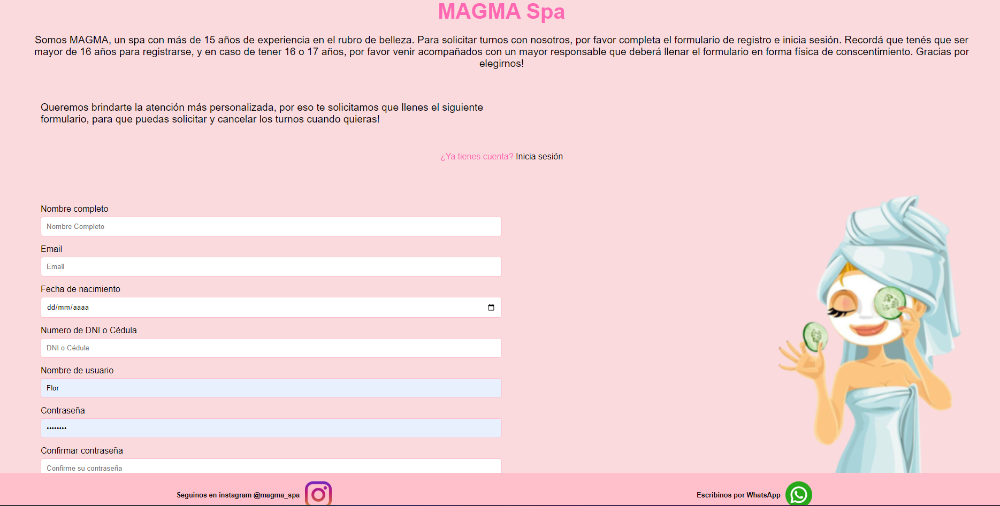
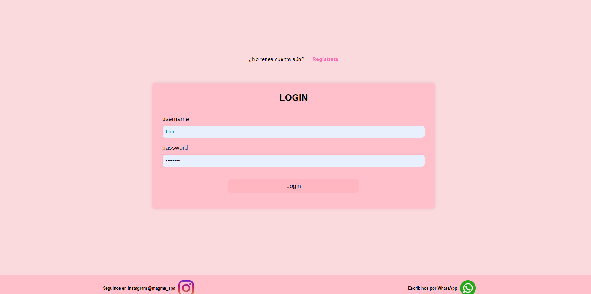
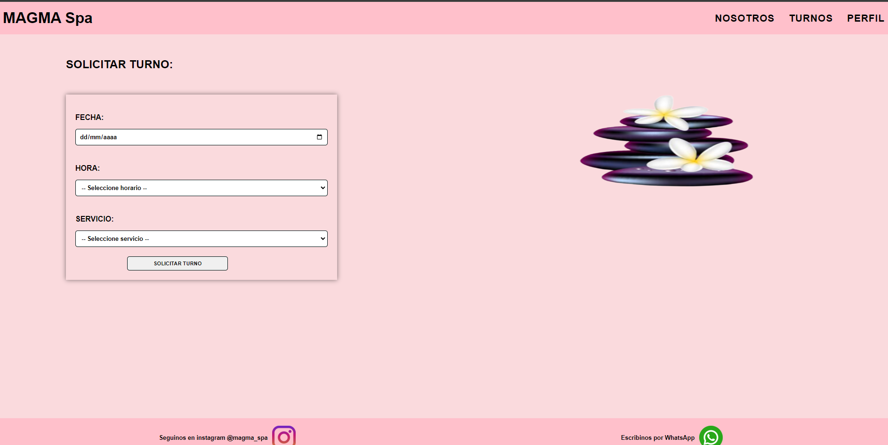
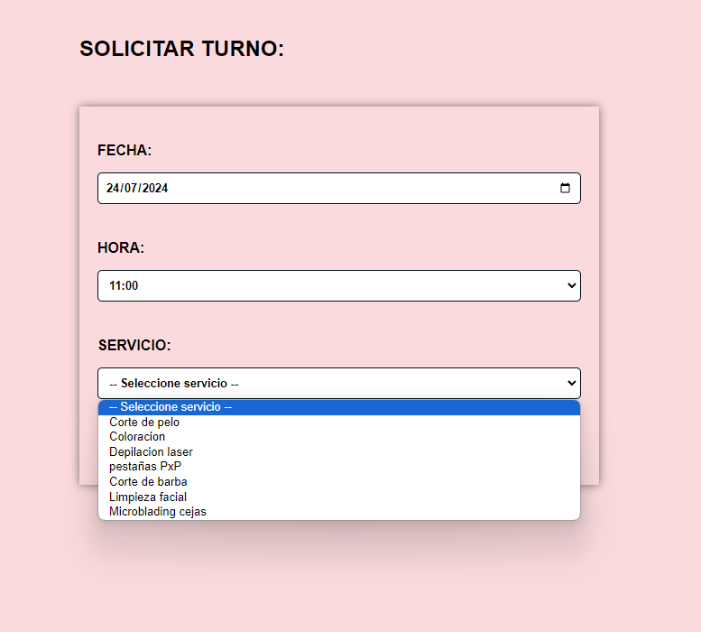
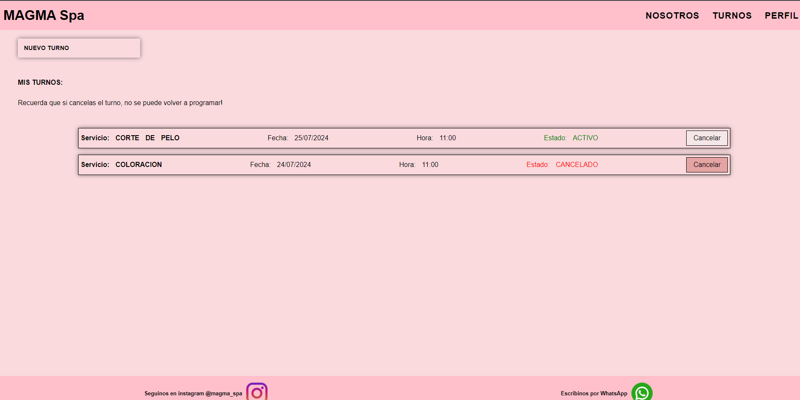
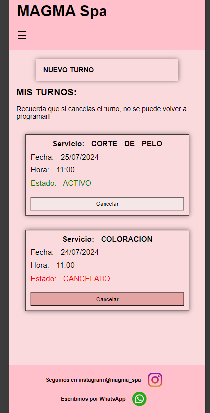
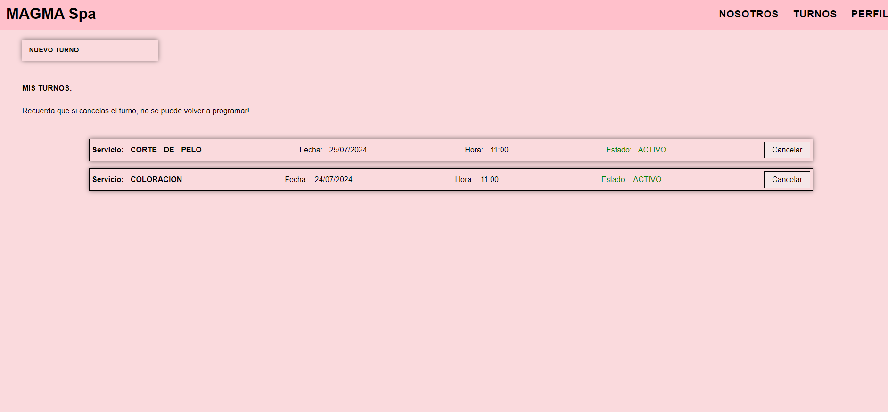
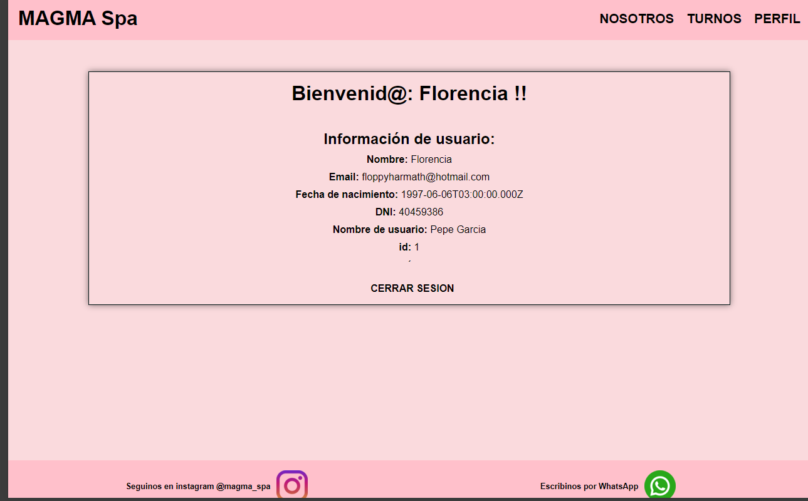

# Digital Turner

## Descripción

Este es un proyecto que maneja turnos de una cosmetica. Permite a los usuarios solicitar, ver y cancelar turnos. 

## Funcionalidades

- **Registro y autenticación de usuarios:** Permite a los usuarios crear una cuenta, iniciar sesión y gestionar su perfil.

- **Solicitud de turnos:** Los usuarios pueden solicitar turnos para diferentes servicios.

- **Gestión de turnos:** Los usuarios pueden ver y cancelar sus turnos.

- **Visualizacion de perfil**: Los usuarios pueden visualizar su perfil

- **Seccion nosotros**: Los usuarios pueden ver la seccion de nosotros

## Tecnologías Usadas

- **Frontend:** React, Vite
- **Backend:** ExpressJS
- **Base de Datos:** PostgreSQL 
- **Estilos:** CSS Modules

## Instalación

- Clonar el repositorio
- Instalar las dependencia
- Inicializar el protecto en back: npm run start
- Inicializar el proyecto en front: npm run build